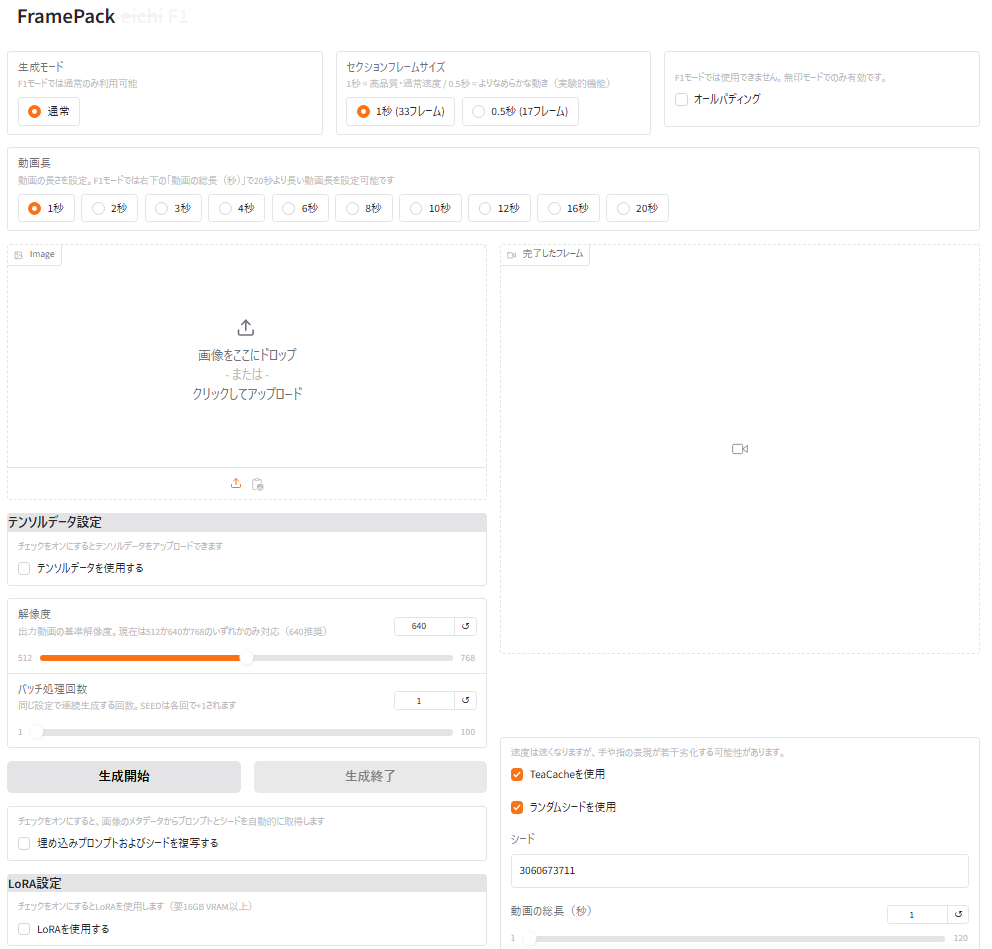
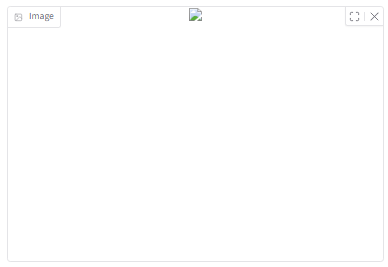

# FramePack-eichi

FramePack-eichi 是基於 lllyasviel 老師的 lllyasviel/FramePack 的分支，以及 nirvash 先生的 nirvash/FramePack 為基礎，所創建的附加功能版本。基於 nirvash 先生的先驅性改進，搭載了許多細節功能。



## 📘 名稱的由來

**Endframe Image CHain Interface (EICHI)**
- **E**ndframe: 強化和最佳化終端幀功能
- **I**mage: 改善關鍵幀圖像處理和視覺回饋
- **CH**ain: 複數的關鍵幀間的連接和關係的強化
- **I**nterface: 直感性的使用者體驗和 UI/UX 的提升

「eichi」是日本語的「睿智」（深刻的智慧、英知）的表達，代表著 AI 技術的進化和人間創造性的的融合，象征著本專案的哲學。
即叡智的差分幀從動畫製作中專案的現地改修仕別。

## 🌟 主要功能

- **高品質動畫生成**: 由單張圖片產生自然動畫　※既存功能
- **多幀鍵幀對應**: 設定多幀鍵幀產生複雜動畫　※nirvash 氏追加功能
- **動畫長度設定**: 1 秒、6 秒、8 秒、10 秒、12 秒、16 秒、20 秒的7種模式　※獨自功能（v1.5.1添加1秒模式、v1.6刪除括號）
- **【試驗實作】所有邊距功能**: 所有區段使用同一邊距值　※v1.4添加
- **【試驗實作】幀尺寸設定**: 0.5秒模式和1秒模式可切換　※v1.5添加
- **【試驗實作】區段特別提示設定**: 可為各區段設定個別提示詞　※v1.2添加
- **【調査中】Hunyuan LoRA支持**: 模型自訂獨特表現　※v1.3添加
- **出力文件管理功能**: 指定輸出文件夾　※v1.2添加
- **プロンプ特管理機能**: 儲存、編輯、再使用プロンプ特　※v1.3添加
- **日誌功能**: 詳細的進度信息和完成時的處理時間　※獨自功能
- **跨平台支持**: Windows以外的環境也能使用基本功能　※多分


### 終點及鍵幀圖像持續性問題（待處理）

部分使用者報告以下問題，目前待處理：

- 生成中止後再度開始時，終點及鍵幀圖像可能未使用
- 一度刪除再上傳圖像，問題可解，但開始前不易察覺
- 一度圖片閉合後再上傳，即可解決
- v1.5.1 Start按鈕按時明確提示圖片再取得，並觀察處理時間

### Hunyuan LoRA對應情況

暫定對應狀態：

- v1.6 LoRA適用邏輯統一，高 VRAM 模式和低 VRAM 模式使用同一直接應用方式
- VRAM管理基準值變更（60GB→100GB），更多用戶低 VRAM 模式運作可能
- 使用需 VRAM 16GB 稍嚴，處理自體比開始前磁碟讀取更長。記憶體推奨多

## 🚀 使用方法

### 基本動畫生成　※既存功能

1. **上傳圖片**: 「Image」 框中上傳圖片
2. **輸入提示詞**: 輸入角色動作提示詞
3. **設定調整**: 調整動畫長度和種子值
4. **開始生成**: 「開始生成」 按鈕點擊

### 高級設定

- **生成模式選擇**:　※獨自功能
  - **通常模式**: 一般動畫生成
  - **循環模式**: 最終幀返回最初幀的循環動畫

- **所有邊距選擇**:　※v1.4 添加、此值越小1次會動畫越激烈
  - **所有邊距**: 所有區段使用同一邊距值
  - **邊距值**: 0~3 的整數值

- **動畫長設定**:　※既存機能的固定化
  - **1 秒**: 短動畫（v1.5.1添加）
  - **6 秒**: 標準動畫
  - **8 秒**: 更長動畫
  - **10 秒**: 停用
  - **12 秒**: 停用
  - **16 秒**: 停用
  - **20 秒**: 停用

  ※v1.6 中動畫模式名的括號説明（例：「10(5x2) 秒」→「10 秒」）已刪除，UI 簡化。同時，顯示秒數和實際處理一致，提升 UI 表示和處理的一致性。

- **鍵幀設定**:　※nirvash 氏追加機能
  - **Image**: 主始鍵幀
  - **Final Frame**: 最終幀（可選）
  - **區段設定**: 各區段的鍵幀圖片和提示詞個別設定可能

  ※v1.6中區段設定 UI 已分離，可按需展開

- **區段別提示詞**: ※v1.2添加【試験實作】
  - 各區段可設定個別提示詞
  - 個別提示詞僅在該區段生成時使用
  - 空白時使用共通提示詞
  - 注意: 本功能為試験實作，效果保証不足

- **Hunyuan LoRA設定**: ※v1.3添加【調査中】
  - 「LoRA 使用」選項: LoRA 的有効/無效切換
  - LoRA 文件選取: 使用 LoRA 文件
  - 適用強度滑塊: LoRA影響度 0.0~1.0 調整
  - 格式選取: HunyuanVideo/Diffusers/Musubi 等格式選擇
  - 注意: Hunyuan LoRA 使用時，進度條開始前讀取時間，總處理時間增加
  - LoRA種類多，樣本數少，有識者請試行

- **出力文件夹設定**: ※v1.2添加
  - 指定輸出文件夾
  - 「保存及打開輸出文件夹」按鈕，設定保存及打開文件夾
  - 設定於應用程式再起動時保留


## 🧠 設定的機制及思考方式

### 基本性的鍵幀圖像的關係

**Image（輸入圖像）、Final Frame（最終幀）及鍵幀圖像的關係**:

1. **優先順序**:
  - 基本的には、各區段的鍵幀圖像已設定，則優先使用
  - 區段 4（第一區段）未設定圖像，則使用輸入圖像
  - 區段 0（最後區段）未設定圖像，則使用最終幀

2. **時序性處理順序**:
- FramePack是「未來到過去」生成的特性
- 將來（動畫的進行）方向思考時，以下順序：
  1. Image（輸入圖像） - 全體始點
  2. 區段 4 的鍵幀圖像 - 最初的區段始點
  3. 區段 3,2,1 的鍵幀圖像 - 中間區段始點
  4. 區段 0 的鍵幀圖像 - 最後的區段始點
  5. Final Frame（最終幀） - 全體終點

3. **區段內的圖像角色**:
  - 鍵幀圖像是該區段動畫的起點
  - 各區段基於指定的鍵幀圖像生成
  - 鍵幀圖像未設定時，使用其他圖像推測的中間狀態

此結構使各區段細微控制可能，實現更自然、一致的動畫。

### FramePack的動作原理

FramePack 的最大特點是「未來到過去」的動畫生成方法。一般的動畫生成 AI 是從第一幀開始順序生成未來，因此隨著動畫時間的延長，畫質下降和一致性降低。

### FramePack-eichi的擴展功能

FramePack-eichi 通過在多個區段獨立配置多個鍵幀圖像，進一步提高品質：

1. **防止最後一部分出現突然變化**：
  - 原始結束影格中第一部分（最後 1 秒）的影像設定存在問題，即影像在最後一部分（大約前 1 秒）突然發生變化。
  - FramePack-eichi 採用簡單粗暴的方法，將關鍵影格影像塞入所有部分。
  - 特別重要的關鍵幀會以紅框突出顯示，並將影像設定為這些關鍵幀，以便自動複製。
  - 如上所述，FramePack 從最後一部分生成視頻，因此部分和關鍵幀的順序也是從最後開始設定的。
  - 在 6 秒模式下，FramePack 可能無法及時完成，循環可能會在到達關鍵影格影像之前結束。
  - 在 8 秒模式下，影像過渡比 6 秒模式更平緩。
  - 在這兩種情況下（包括下文所述的多場景），差異影像越大，運動變化越大，產生的運動越流暢。

※在 v1.6 中，關鍵影格高亮（紅框）已被移除，使用者介面也得到了簡化。

2. **循環功能優化**：
  - 循環模式下，第一個關鍵幀自動複製到最後一幀
  - 從 v1.5.1 開始，在普通模式下從輸入影像複製的功能已停止，僅在循環模式下啟用影像複製
  - 透過將循環的起始位置設為關鍵影格影像 1，您可以建立流暢的循環影片

3. **各部分提示設定**：※v1.2 新增 [測試實作]
  - 透過為每個部分設定獨特的提示，您可以實現每個部分不同的動作和表情。
  - 例如，您可以自然地表達「走」→「坐」→「揮手」等動作變化。
  - 提示效果雖然細微，但與關鍵影格影像結合使用效果更佳。

4. **改進了動態片段計算**：※v1.6 新增
- 新增直接根據秒數計算片段數的功能，提升一致性與效率
- 修改了邏輯，從根據幀數計算片段數改為直接根據秒數計算片段數

### 設定提示的技巧

提示設定與關鍵影格影像同樣重要：

1. **提示的基本結構**：
  - 依照主題 → 動作 → 其他元素的順序進行寫作是有效的。
  - 例如：`The character walks gracefully, with clear movements, across the room.`

2. **動畫的指定程度**:
  - 無示範：基本動畫生成
  - 簡易動畫：即使是 `moves back and forth, side to side` 也能產生基本動畫。
  - 工具動效影片：如果您指定諸如 `dances powerfully, with clear movements, full of energy` 等細節，則會產生額外的動效影片。

3. **注意事項**：
  - 使用暗示大動作的詞語，例如“跳舞”，可能會導致動作比你預期的更誇張。
  - 實用提示範例：
    - 穩定的動作：`The character breathes calmly, with subtle body movements.`
    - 中程度的動作：`The character walks forward, gestures with hands, with natural posture.`
    - 複雜的動作：`The character performs dynamic movements with energy and flowing motion.`

4. **提示深層結構（LLAMA 和 CLIP 分離）**:
  - 在 FramePack 內部，提示由兩種不同的模型處理：

  - **LLAMA 模型（限制 256 個 token）**：
    - 負責文本的詳細理解和上下文處理
    - 用於控制影片的整體內容和順序
    - 預計字元數：約 1000-1300 個字元（英文）或 200-400 個字元（日文）
    - 參與控制場景的脈絡和敘事

  - **CLIP 模型（限制 77 個 token）**：
    - 專門用於將圖像與文字關聯的模型
    - 影響視訊畫面特定視覺特徵的生成
    - 預計字元數：約 300-400 個字元（英文）或 50-150 個字元（日文）
    - 參與控制風格、主題和視覺屬性

5. **撰寫有效提示的策略**：
  - **前 300-400 個字元（英文）/50-150 個字元（日文）**：
    - LLAMA 和 CLIP 均涉及的重要“視覺部分”。
    - 包括主要視覺元素、風格、主題和整體基調。
    - 範例：`A young woman with long flowing hair, cinematic lighting, detailed facial features, soft expressions, gentle movements`

  - **後者 600-900 個字元（英語）/150-250 個字元（日文）**：
    - 僅由 LLAMA 處理的“敘事部分”。
    - 您可以在此處撰寫動作細節、場景背景和序列訊息。
    - 例如：`The camera slowly pans from left to right. The woman gradually turns her head, her expressions changing from neutral to a slight smile. There is a sense of emotional buildup as if emotional music is playing in the background.`

6. **如何使用特定章節提示**：※新增於 v1.2 [測試實作]
  - 特定章節提示應簡短，並專注於該章節的重要操作
  - 清晰、具體的指示比長句更有效
  - 例：第 1 節“行走動作”，第 2 節“坐下動作”，第 3 節“揮手動作”
  - 注意：章節提示的效果微妙，務必將其與圖片設定結合

7. **LoRA 使用**：※新版本 v1.3 [測量測試工作]
  - LoRA 的選擇和呈現組合可透過特定樣式或表達方式進行增強。
  - LoRA 效果傳輸強度調節（0.1-0.3 為細微，0.5-0.8 為顯著）
  - 呈現文字與 LoRA 的選擇和匹配，達到最佳效果
  - v1.6 版本採用統一的高顯存模式與低顯存模式應用方法，提升一致性與穩定性

### 選擇有效的差異影像

FramePack 產生的視訊品質很大程度上取決於關鍵影格影像的選擇。選擇理想差異影像的重點：

1. **最佳差異等級**：
   - **差異過小**：使用幾乎相同的影像（即所謂的「智慧差異」）幾乎不會產生任何運動。
   - **差異過大**：使用完全不相關的影像將無法產生自然的運動。
   - **理想差異**：最佳差異是AI能夠找到相關變化的差異，例如同一角色的不同姿勢。

2. **保持相關性**：
  - 例如，簡單地水平翻轉影像會被 AI 識別為完全不同的影像，並且不會產生自然的移動。
  - 臉部方向、手部位置、身體姿勢等的變化是理想的差異元素。
  - 盡可能保持背景和服裝的一致性，使 AI 能夠專注於角色的動作。
  - 諷刺的是，圖像生成 AI 根據相似提示創建的角色的波動，正是理想的差異元素之一。

3. **理想的差異影像特徵**：
  - 同一角色，姿勢略有變化
  - 面部表情細微變化（例如，從面無表情到微笑。然而，如果面部位置不變，則動作較弱）
  - 姿勢變化伴隨手和手臂的自然運動
  - 頭部方向逐漸變化

4. **實驗方法**：
  - 選擇差異圖像更具藝術性而非科學性，因此反覆試驗至關重要。
  - 從相似姿勢的差異開始，逐步調整差異大小是有效的。
  - 記錄成功的組合，並將它們應用到未來的作品中。

5. ** 影像生成 AI 與不同影像組合 **：
  - 當不存在理想的差異影像時，可使用影像產生 AI 產生相同角度的不同姿勢。
  - 當前句子中指定的姿勢變化將導致迴避程度發生變化，因此實際的自然動作也會發生變化。

這種結構化的方法有助於我們充分利用兩種模型的優勢並產生更具表現力的影片。

## 💻 如何安裝

### 先決條件

- Windows 10/11（Linux/Mac 也能使用部分基本功能）
- NVIDIA GPU (建議 RTX 30/40 系列、最低 8GB VRAM)
- CUDA Toolkit 12.6
- Python 3.10.x
- 最新的 NVIDIA GPU 驅動

※ v1.2 改進了在 Linux 上的操作，增加了開放功能，但某些功能可能會受到限制。

### 安裝步驟

#### 安裝公式包

首先，您需要安裝原始 FramePack。

1. 從 [官方 FramePack](https://github.com/lllyasviel/FramePack?tab=readme-ov-file#installation) 下載 Windows 一鍵安裝程式。
   點選「點選此處下載一鍵安裝套件 (CUDA 12.6 + Pytorch 2.6)」。

2. 解壓縮下載的軟體包，執行 `update.bat`，然後使用 `run.bat` 啟動它。
   執行 `update.bat` 非常重要，否則您將使用可能存在尚未修復的 bug 的舊版本。

3. 首次啟動應用程式時，將自動下載必要的模型（約 30GB）。
   如果您已經下載了模型，請將其放在 `framepack\webui\hf_download` 資料夾中。

4. 此時它會起作用，但如果您沒有安裝加速程式庫（Xformers、Flash Attn、Sage Attn），則該過程會更慢。
   ```
   Currently enabled native sdp backends: ['flash', 'math', 'mem_efficient', 'cudnn']
   Xformers is not installed!
   Flash Attn is not installed!
   Sage Attn is not installed!
   ```

   處理時間差異：*RAM：32GB，RXT4060Ti (16GB)
   - 未安裝庫時：約 4 分 46 秒/25 步
   - 安裝庫時：約 3 分 17 秒至 3 分 25 秒/25 步

5. 若要安裝加速程式庫，請從 [Issue #138](https://github.com/lllyasviel/FramePack/issues/138) 下載 `package_installer.zip`，解壓縮後在根目錄中執行 `package_installer.bat`（在命令提示字元中按 Enter 鍵）。

6. 再次運行並檢查庫是否已安裝：
   ```
   Currently enabled native sdp backends: ['flash', 'math', 'mem_efficient', 'cudnn']
   Xformers is installed!
   Flash Attn is not installed!
   Sage Attn is installed!
   ```
   作者執行程式時，Flash Attn 尚未安裝。
   注意：即使未安裝 Flash Attn，處理速度也幾乎沒有影響。根據測試結果，安裝和未安裝 Flash Attn 的速度差異可以忽略不計，即使在「未安裝 Flash Attn！」的狀態下，處理速度也約為 3 分 17 秒/25 步，與所有程式都安裝時（約 3 分 25 秒/25 步）幾乎相同。
   我認為是否安裝 Xformers 的影響最大。

#### 安裝 FramePack-eichi

1. 將 `run_endframe_ichi.bat` 放在 FramePack 的根目錄中。
2. 將下列檔案和資料夾放在 `webui` 資料夾中：
    - `endframe_ichi.py` - 主應用程式文件
    - `eichi_utils` 資料夾 - 實用程式模組（v1.3.1 修訂版）
    - `__init__.py`
    - `frame_calculator.py` - 幀大小計算模組
    - `keyframe_handler.py` - 關鍵影格處理模組
    - `keyframe_handler_extended.py` - 關鍵影格處理模組
    - `preset_manager.py` - 預設管理模組
    - `settings_manager.py` - 設定管理模組
    - `video_mode_settings.py` - 視訊模式設定模組
    - `lora_utils` 資料夾 - LoRA 相關模組（v1.3 新增，v1.3.2 改進）
    - `__init__.py`
    - `dynamic_swap_lora.py` - LoRA 管理模組（鉤子方法已停用，僅支援直接應用方法）
    - `lora_loader.py` - LoRA 載入器模組
    - `lora_check_helper.py` - LoRA 應用程式狀態檢查模組（在 v1.3.2 中新增）
3. 執行 `run_endframe_ichi.bat` 將啟動 FramePack-eichi WebUI。

#### Linux 安裝說明

在 Linux 上，您可以按照以下步驟操作：

1. 下載並放置上面列出的所需檔案和資料夾。
2. 在終端機中執行以下命令：
    ```bash
    python endframe_ichi.py
    ```

## 🛠️ 配置資訊

### 基本設定（Windows 系統為 bat 檔案）
  - **連接埠設定**：`--port` 參數（預設值：8001）
    - WebUI 使用的連接埠號碼
    - 如果與其他應用程式衝突，請更改
  - **伺服器位址**：`--server` 參數（預設值：'127.0.0.1'）
    - 如果在本地網路內訪問，請更改為 `0.0.0.0`
  - **自動啟動瀏覽器**：`--inbrowser` 選項
    - 啟動時自動開啟瀏覽器

### 性能設定
- **GPU 記憶體預留設定**：`gpu_memory_preservation` 滑桿（預設值：9GB）※現有功能
  - 值越小 = 使用更多 VRAM = 處理速度更快
  - 值越大 = 使用更少 VRAM = 運作更穩定
  - 工作原理：設定值越小，為 Transformer 模型釋放的 VRAM 越多
  - 建議值：
    - 8GB VRAM：7-8GB
    - 12GB VRAM：6-8GB
    - 16GB 或以上：約 6GB
  - 注意：如果您同時執行其他應用程序，請增加此值
  - 此工具預留 3GB 記憶體空間以防止記憶體交換，以便其他影像產生工具可以在背景執行
  - 如果您使用 LoRA，最好提供更多記憶體空間

- **高記憶體模式**：自動偵測（v1.5.1：60GB 或以上，v1.6：100GB 或以上可用記憶體）※功能改進
  - 啟用後：模型始終保留在 GPU 上，減少記憶體傳輸開銷
  - 效果：處理速度提升高達 20%
  - 在 v1.6 中，標準值已提高，現在大多數環境中都使用低顯存模式
  - 低顯存模式採用與高顯存模式相同的直接應用方法，提高了功能的一致性

### 生成設定
- **幀大小設定**：`frame_size` 下拉選單（預設值：1 秒）※v1.5 新增
  - 0.5 秒：產生 0.5 秒的畫面。片段數量和處理時間幾乎會翻倍。
  - 在 All-Budding 0 模式下，您可以透過為每個畫面影像添加差異來創建更激烈的運動。
  - 1 秒：產生 1 秒的畫面。

- **步數**：`steps` 滑桿（預設值：25）※現有功能
  - 增加該值可以提高質量，但處理時間也會相應增加。
  - 建議範圍：20-30（20 通常可以獲得幾乎相同的品質）
  - 15 或更低：品質明顯下降

- **TeaCache**：`use_teacache` 複選框（預設：啟用）※現有功能
  - 啟用：處理速度提升約 15-20%
  - 副作用：手和指尖等精細細節可能會略有下降
  - 用途：建議用於一般視訊生成，當精細細節很重要時停用

- **隨機種子值**：`seed` 輸入一個值或勾選「使用隨機種子」複選框 ※由 nirvash 新增
  - 相同的種子值 = 可重複的結果
  - 隨機種子：每次產生不同的動作
  - 注意：即使種子相同，如果提示或影像發生變化，結果也會發生變化

- **精煉 CFG 比例**：`gs` 滑桿（預設值：10.0）※現有功能
  - 精煉引導比例值
  - 值越小，移動越自由（與提示偏差越大）
  - 值越大，移動越忠實於提示（移動可能會受到限制）
  - 建議：保留預設值（進階使用者可以更改）

### LoRA 設定（v1.3 新增，v1.6 改進）
- **使用 LoRA**：`use_lora` 複選框（預設為停用）
  - 啟用：使用 LoRA 檔案自訂模型
  - 使用 LoRA 時，計數器啟動前的等待時間可能會更長。

- **LoRA 檔案**：`lora_file` 檔案選擇元件
  - 指定要使用的 LoRA 文件
  - 支援格式：僅 FramePack 格式（已在 v1.3.2 版本中驗證）

- **LoRA 強度**：`lora_strength` 滑桿（預設值：0.8）
  - 範圍：0.0 至 1.0
  - 值較小：影響較小
  - 值較大：影響較大
  - 最佳值因 LoRA 檔案而異

- **LoRA 格式**：單選按鈕
  - HunyuanVideo：適用於 Hunyuan Video 的 LoRA 格式
  - Diffusers：Diffusers 格式的 LoRA

### 幀設置
- **影片長度**：單選按鈕 + `total_second_length` 滑桿 ※獨特功能
  - **1 秒**：短片（約 30 幀 @ 30fps） - v1.5.1 新增
  - **6 秒**：標準模式（約 180 幀 @ 30fps）
  - **8 秒**：擴展模式（約 240 幀 @ 30fps）
  - **10 秒**：部分刪除（約 300 幀 @ 30fps）
  - **12 秒**：部分刪除（約 360 幀 @ 30fps）
  - **16 秒**：部分刪除（約 480 幀 @ 30fps）
  - **20 秒**：部分刪除（約 600 幀 @ 30fps）

  ※在v1.6中，提高了顯示的秒數與實際的幀數和節數的一致性。

- **自動關鍵影格複製**：`enable_keyframe_copy` 複選框（預設：停用 - 在 v1.5.1 中變更）※獨特功能
  - 啟用：關鍵影格影像自動複製到其他部分
  - 停用：每個關鍵影格必須單獨設置
  - 用途：設計複雜動作的進階使用者可以停用此功能
  - 在 v1.6 中，此功能在使用者介面中隱藏，並作為設定內置

### 輸出設定
- **輸出資料夾**：輸出資料夾設定欄位（預設值：`outputs`）※v1.2 新增
  - 用於保存生成的影片和圖片的目標位置
  - 您可以在輸入欄位中直接輸入資料夾名稱
  - 您可以使用「開啟已儲存和輸出資料夾」按鈕開啟資料夾
  - 設定以 JSON 格式儲存，即使重新啟動後仍會保留

- **儲存章節靜態影像**：勾選 `save_section_frames` 複選框（預設為停用）※nirvash 新增的功能
  - 啟用：每個章節的最後一幀將儲存為靜態影像
  - 用途：當您想檢查每個章節之間的連接時非常有用

- **儲存片段影片**：勾選 `keep_section_videos` 複選框（預設為停用）※獨特功能
  - 啟用：每個片段的影片檔案都會被保留，如果您點擊「結束」按鈕，影片檔案也會保留。
  - 停用：僅儲存最終完成的影片（中間檔案會被刪除），因此請小心不要將其放入回收站。
  - 用途：當您想單獨查看每個片段的進度時非常有用。

### 提示符號管理
  - **儲存預設**：「儲存」按鈕
    - 使用名稱儲存目前提示符
    - 使用空名稱儲存，將其設定為啟動時的預設提示符

  - **套用預設**：「套用」按鈕
    - 將所選預設的提示符號套用到目前生成設定

  - **預設管理**：
    - 刪除：刪除不需要的預設（預設預設無法刪除）
    - 清除：清除編輯字段

## 🔧 故障排除

### 關於 h11 錯誤

首次啟動工具並匯入影像時，您可能會遇到許多錯誤，例如：
※錯誤將顯示在控制台中，但圖像不會顯示在 GUI 中。


```
ERROR:    Exception in ASGI application
Traceback (most recent call last):
  File "C:\xxx\xxx\framepack\system\python\lib\site-packages\uvicorn\protocols\http\h11_impl.py", line 404, in run_asgi
```
當處理 HTTP 回應時出現問題時，會顯示此錯誤。
如上所述，這通常發生在啟動過程的早期，即 Gradio 尚未完成啟動時。

解決方案：
  1. 刪除有「X」按鈕的圖片，然後重新嘗試上傳。
  2. 如果上傳同一文件重複失敗：
    - 完全停止 Python 進程，然後重新啟動應用程式
    - 重新啟動電腦，然後重新啟動應用程式

如果錯誤仍然存在，請嘗試其他圖片檔案或減小圖片大小。

### 記憶體不足錯誤

在 Windows 系統中，如果顯示「CUDA out of memory」或「RuntimeError: CUDA error」，請按照以下步驟操作：

1. `gpu_memory_preservation` 的值設定為 12-16GB
2. 關閉其他使用 GPU 的應用程式
3. 重新啟動應用程式
4. 降低圖片解析度（640x640 附近）

### LoRA相關的問題（v1.3以降）

在 Windows 系統中，如果顯示「LoRA is disabled because there is no target for blending」，請按照以下步驟操作：

1. 別的LoRA文件試用
2. LoRA形式的選択確認
3. LoRA強度調整至 0.5-0.8
4. 確認提示符與LoRA內容一致

在 v1.6 版本中，LoRA 的應用方法已統一，現在可以像在高顯存模式下一樣在低顯存模式下直接套用 LoRA。這提高了穩定性，但可能會增加顯存佔用率。

### 影片顯示問題

產生的影片在某些瀏覽器（尤其是 Firefox）和 macOS 上有無法顯示的問題：

- 問題：影片在 Gradio UI 中不顯示，Windows 系統上不顯示縮圖，部分播放器無法播放
- 原因：`\framepack\webui\diffusers_helper\utils.py` 中的視訊編解碼器設定有問題

此問題需要在原始程式碼庫 (lllyasviel/FramePack) 中修復。 FramePack-eichi 將盡量避免修改原始原始碼，並等待原始原始碼修復。

臨時解決方法：
1. 使用相容性較高的播放器（例如 VLC）播放產生的影片文件
2. 在其他影片編輯軟體中開啟並重新儲存
3. 如果您具備技術知識，可以手動套用以下修復程序：
    ```python
    # \framepack\webui\diffusers_helper\utils.py 的對應部分
    # 修改前
    torchvision.io.write_video(output_filename, x, fps=fps, video_codec='libx264', options={'crf': '0'})
    # 修改後
    torchvision.io.write_video(output_filename, x, fps=fps, video_codec='libx264', options={'crf': '17', 'pix_fmt': 'yuv420p'})
    ```

※該問題已在原始儲存庫中作為拉取請求#49提出，預計將在未來的更新中解決。

## 📝 更新日誌

### 2025-04-26：版本 1.6.0
- **UI/UX 改進**：
- 將區塊設定拆分為折疊面板，僅在必要時展開
- 簡化視訊模式名稱（例如，「10 (5x2) 秒」 → “10 秒”）
- 移除關鍵影格高亮
- 將不必要的功能（例如 EndFrame 影響調整、關鍵影格自動複製功能）移至內部設置
- **技術改進**：
- 變更 VRAM 管理標準值（60GB → 100GB）
- 改進區塊計算邏輯（增加直接從秒數計算的函數）
- 提高幀數和區塊數的一致性（確保與顯示的秒數一致）
- 最佳化偵錯輸出

### 2025-04-25：版本 1.5.1
- **新增「1 秒」短影片產生模式**：
- 支援 1 秒（約 30 幀，30fps）
- **更改預設影片時長**：
- 將預設值從“6 秒”更改為“1 秒”
- **優化輸入影像複製操作**：
- 在普通模式下停止從輸入影像複製
- 循環模式下啟用僅複製到最後一個影像
- **更改關鍵影格自動複製功能的預設值**：
- 預設關閉，以便更精細地控制
- 必要時可開啟自動複製功能
- **提升影像處理穩定性**：
- 改進了按下「開始」按鈕時重新獲取影像的正確方法
- 新增了預覽影像的明確清除流程

### 2025-04-24：版本 1.5.0
- **新增幀大小設定**：
- 可在 0.5 秒模式和 1 秒模式之間切換
- 根據幀大小動態調整 latent_window_size

### 2025-04-24：版本 1.4.0
- **新增所有填滿功能**：
- 所有部分使用相同的填充值
- 此值越小，單次會話中的運動越劇烈。

### 2025-04-24：版本 1.3.3
- **重新審視 LoRA 應用功能**：
- 直接 LoRA 載入模式已被否決，因為它需要金鑰匹配才能設定參數。統一為 DynamicSwap，並等待後續情況。
- 實現了獲取參數數量的日誌顯示。

### 2025-04-24：版本 1.3.2
- **統一 LoRA 應用功能**：
- 統一在低顯存模式下直接套用 LoRA（DynamicSwap）的方式，與在高顯存模式下相同。
- 廢除了 hook 方法，僅支援更穩定的直接應用方式。
- 改進了內部實現，同時保持了介面的兼容性。
- **增強了調試和驗證功能**：
- 新增了用於檢查 LoRA 應用程式狀態的專用實用程式 (lora_check_helper.py)
- 提供詳細的日誌輸出和偵錯資訊。

### 2025-04-24：版本 1.3.1
- **程式碼庫重構**：將程式碼組織成多個模組，以提高可維護性和可擴展性
- `eichi_utils`：管理關鍵影格處理、設定管理、預設管理和視訊模式設定
- `lora_utils`：聚合 LoRA 相關函數

### 2025-04-23：版本 1.3
- **[研究中] 新增混元 LoRA 支援**：自訂模型並新增自訂表情
- **[測試實作] 新增 EndFrame 影響度設定**：最終影格的影響度可在 0.01 至 1.00 之間調整（nirvash 已知）

### 2025-04-23：版本 1.2
- **新增「20 (4x5) 秒」模式**：支援產生包含 5 個部分的長視頻
- **新增每個部分的提示功能**：允許為每個部分設定單獨的提示 [測試實作]
- **增強輸出資料夾管理功能**：支援指定輸出資料夾和獨立於作業系統的開啟方式
- **改進設定檔管理**：使用基於 JSON 的設定檔持久化設定
- **增強跨平台支援**：改進了在 Windows 以外環境下的操作

### 2025-04-22：版本 1.1
- **新增「16（4x4）秒」模式**：支援由 4 個部分組成的長視頻
- **改進了生成過程中的進度顯示**：現在會顯示部分資訊（例如「部分：3/15」），讓您更容易了解進度，尤其是在生成長影片時
- **設定檔結構**：視訊模式設定現在被拆分到單獨的檔案中，提高了可擴展性

### 2025-04-21：首次發布
- 優化提示管理功能
- 新增關鍵影格引導功能

## 🤝 謝辞

本項目基於以下項目的貢獻：

- [lllyasviel/FramePack](https://github.com/lllyasviel/FramePack) - 感謝原作者 lllyasviel 的精湛技術與創新
- [nirvash/FramePack](https://github.com/nirvash/FramePack) - 感謝 nirvash 的開創性改進和擴展

## 📄 許可證

本項目遵循 [Apache 許可證 2.0](LICENSE) 發布。這與原 FramePack 專案的授權一致。

---

**FramePack-eichi** - 端幀圖片連結口
旨在實現更直覺、更靈活的影片生成